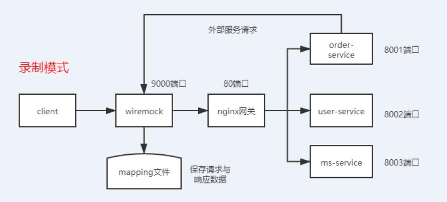
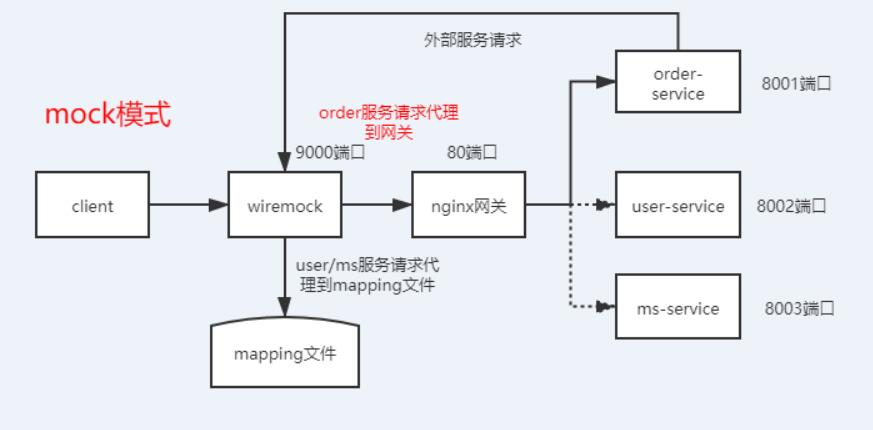

# mock_demo

### 一、介绍
基于wiremock的自动化mock&接口自动化录制工具

### 二、背景
执行接口自动化用例时，调用A服务接口报错，后台定位到是A服务调用B服务的问题，需要解除A服务对B服务的依赖

### 三、实现方式
使用工具：wiremock

具体实现：将网关请求导向wiremock服务，再由wiremock代理到网关，在wiremock服务实现请求录制&回放，请求路由的功能

github地址: [https://github.com/xglh/mock_demo](https://github.com/xglh/mock_demo)  

> service_demo目录为被测服务  
> wiremock目录为wiremock服务  
> case目录为自动化脚本  
 
   
##### 1）录制模式下，录制全量请求与响应数据(mapping文件)，为mock做准备
  
##### 2）mock模式下，将order服务请求代理到网关，user/ms服务代理到mapping文件  


### 四、手动操作步骤
>预置场景：  
>client端请求 http://{{mock_host}}/order-service/order/detail/r001，order服务触发请求user/ms外部服务接口  
>mock_host代表localhost:9000变量  

#### 1、启动服务
启动wiremock，nginx，order-service，user-service，ms-service  

#### 2、将wiremock代理到nginx网关，开启录制模式
```python
# 开始录制
POST http://{{mock_host}}/__admin/recordings/start
body:
{  
   "targetBaseUrl": "http://localhost:80"   # 所有请求代理到网关
}
 
# 获取mock服务状态
GET http://{{mock_host}}/__admin/recordings/status
# 返回结果：
{
  "status": "Recording"
}
```  

#### 3、client发送请求
```python
# 发送客户端请求
GET http://{{mock_host}}/order-service/order/detail/r001

# 返回结果
{
    "code": 0,
    "msg": "success",
    "data": {
        "orderId": "r001",
        "userName": "光头强",
        "productName": "火花塞"
    }
}
```

#### 4、停止wiremock录制，获取到录制到的mapping文件
```python
# 停止wiremock录制&获取mapping文件
POST http://{{mock_host}}/__admin/recordings/stop

# 返回结果
{
  "mappings": [
    {
      "id": "89fce797-ce35-497d-9d7c-fc14b1533be3",
      "name": "user-service_user_detail_u001",
      "request": {
        "url": "/user-service/user/detail/u001",
        "method": "GET"
      },
      "response": {
        "status": 200,
        "body": "{\"code\": 0, \"msg\": \"success\", \"data\": {\"userId\": \"u001\", \"userName\": \"\光\头\强\"}}",
        "headers": {
          "Server": "nginx/1.17.4",
          "Date": "Mon, 16 Mar 2020 02:33:07 GMT",
          "Content-Type": "application/json;charset=utf-8",
          "Connection": "keep-alive"
        }
      },
      "uuid": "89fce797-ce35-497d-9d7c-fc14b1533be3",
      "persistent": true
    },
    {
      "id": "285c6792-3127-406b-843c-7f0352103c23",
      "name": "ms-service_product_detail_p001",
      "request": {
        "url": "/ms-service/product/detail/p001",
        "method": "GET"
      },
      "response": {
        "status": 200,
        "body": "{\"code\": 0, \"msg\": \"success\", \"data\": {\"productId\": \"p001\", \"productName\": \"\火\花\塞\"}}",
        "headers": {
          "Server": "nginx/1.17.4",
          "Date": "Mon, 16 Mar 2020 02:33:07 GMT",
          "Content-Type": "application/json;charset=utf-8",
          "Connection": "keep-alive"
        }
      },
      "uuid": "285c6792-3127-406b-843c-7f0352103c23",
      "persistent": true
    },
    {
      "id": "daa18bdc-c13f-416f-bbf0-429a7259fcfc",
      "name": "order-service_order_detail_r001",
      "request": {
        "url": "/order-service/order/detail/r001",
        "method": "GET"
      },
      "response": {
        "status": 200,
        "body": "{\"code\": 0, \"msg\": \"success\", \"data\": {\"orderId\": \"r001\", \"userName\": \"\光\头\强\", \"productName\": \"\火\花\塞\"}}",
        "headers": {
          "Server": "nginx/1.17.4",
          "Date": "Mon, 16 Mar 2020 02:33:07 GMT",
          "Content-Type": "application/json;charset=utf-8",
          "Connection": "keep-alive"
        }
      },
      "uuid": "daa18bdc-c13f-416f-bbf0-429a7259fcfc",
      "persistent": true
    }
  ]
}
```

#### 5、将order服务的mapping文件剔除，并重新设置服务转发规则：order服务代理到本地，user/ms服务代理到mapping  
```python
# 开始录制
POST http://{{mock_host}}/__admin/recordings/start
body:
{  
   "targetBaseUrl": "http://localhost:80"   # 所有请求代理到网关
}
 
 
# 清空mapping文件
DELETE http://{{mock_host}}/__admin/mappings
 
 
# 设置order服务代理，/order-service请求代理到nginx网关
POST http://{{mock_host}}/__admin/mappings
body:
 {
    "request": {
        "urlPattern": "^/order-service/.*"
    },
    "response": {
        "proxyBaseUrl": "http://localhost:80"
    }
}
 
 
# 设置user服务mapping文件，将返回字段加上mock标记予以区别
POST http://{{mock_host}}/__admin/mappings
body:
{
      "id": "89fce797-ce35-497d-9d7c-fc14b1533be3",
      "name": "user-service_user_detail_u001",
      "request": {
        "url": "/user-service/user/detail/u001",
        "method": "GET"
      },
      "response": {
        "status": 200,
        "body": "{\"code\": 0, \"msg\": \"success\", \"data\": {\"userId\": \"u001\", \"userName\": \"光头强_mock\"}}",
        "headers": {
          "Server": "nginx/1.17.4",
          "Date": "Mon, 16 Mar 2020 02:33:07 GMT",
          "Content-Type": "application/json;charset=utf-8",
          "Connection": "keep-alive"
        }
      },
      "uuid": "89fce797-ce35-497d-9d7c-fc14b1533be3",
      "persistent": true
    }
 
 
# 设置ms服务mapping文件，将返回字段加上mock标记予以区别
POST http://{{mock_host}}/__admin/mappings
body
{
      "id": "285c6792-3127-406b-843c-7f0352103c23",
      "name": "ms-service_product_detail_p001",
      "request": {
        "url": "/ms-service/product/detail/p001",
        "method": "GET"
      },
      "response": {
        "status": 200,
        "body": "{\"code\": 0, \"msg\": \"success\", \"data\": {\"productId\": \"p001\", \"productName\": \"火花塞_mock\"}}",
        "headers": {
          "Server": "nginx/1.17.4",
          "Date": "Mon, 16 Mar 2020 02:33:07 GMT",
          "Content-Type": "application/json;charset=utf-8",
          "Connection": "keep-alive"
        }
      },
      "uuid": "285c6792-3127-406b-843c-7f0352103c23",
      "persistent": true
    }
 
# 停止user,ms服务,再次发送客户端请求
GET http://{{mock_host}}/order-service/order/detail/r001

# 返回结果
{
    "code": 0,
    "msg": "success",
    "data": {
        "orderId": "r001",
        "userName": "光头强_mock",
        "productName": "火花塞_mock"
    }
}
# 返回字段带有mock标记
```

### 五、自动化mock&接口自动化录制
>将以上手动操作步骤用自动化脚本实现，并生成自动化脚本  

##### 1、在case/play_and_record.py执行mock_start()，发送client请求
##### 2、执行生成脚本方法，生成case_002.py脚本
生成脚本如下：
```python
import requests
from case.mock_ops import mock_url, nginx_url, mock_start
 
class TestOrderClass:
 
    def setup(self):
        print('setup')
        mock_start()
        # 清空mapping文件
        path = '/__admin/mappings'
        requests.delete(mock_url + path)
         
        # 新增目标服务proxy规则
        body = {"request": {"urlPattern": "^/order-service/.*"}, "response": {"proxyBaseUrl": nginx_url}}
        response = requests.post(mock_url + path, json=body)
        assert response.status_code == 201
         
        # 新增mock服务mapping
        # 解除外部服务依赖
        body = {'id': 'abf13a9b-07b1-4157-acff-4256f6415874', 'name': 'user-service_user_detail_u001', 'request': {'url': '/user-service/user/detail/u001', 'method': 'GET'}, 'response': {'status': 200, 'body': '{"code": 0, "msg": "success", "data": {"userId": "u001", "userName": "光头强"}}', 'headers': {'Server': 'nginx/1.17.4', 'Date': 'Mon, 16 Mar 2020 03:46:30 GMT', 'Content-Type': 'application/json;charset=utf-8', 'Connection': 'keep-alive'}}, 'uuid': 'abf13a9b-07b1-4157-acff-4256f6415874', 'persistent': True}
        response = requests.post(mock_url + path, json=body)
        assert response.status_code == 201
 
        body = {'id': '4a154b49-1ae0-4f92-aadc-680814dae626', 'name': 'ms-service_product_detail_p001', 'request': {'url': '/ms-service/product/detail/p001', 'method': 'GET'}, 'response': {'status': 200, 'body': '{"code": 0, "msg": "success", "data": {"productId": "p001", "productName": "火花塞"}}', 'headers': {'Server': 'nginx/1.17.4', 'Date': 'Mon, 16 Mar 2020 03:46:30 GMT', 'Content-Type': 'application/json;charset=utf-8', 'Connection': 'keep-alive'}}, 'uuid': '4a154b49-1ae0-4f92-aadc-680814dae626', 'persistent': True}
        response = requests.post(mock_url + path, json=body)
        assert response.status_code == 201
 
    def teardown(self):
        print('teardown')
        # 清空mapping文件
        path = '/__admin/mappings'
        requests.delete(mock_url + path)
         
        # 恢复初始转发状态
        body = {"request": {"method": "ANY"}, "response": {"proxyBaseUrl": nginx_url}}
        response = requests.post(mock_url + path, json=body)
        assert response.status_code == 201
         
    def test(self):
        # 测试目标服务
        path = '/order-service/order/detail/r001'
        response = requests.get(mock_url + path)
        # {'code': 0, 'msg': 'success', 'data': {'orderId': 'r001', 'userName': '光头强', 'productName': '火花塞'}}
        assert response.status_code == 200, u'url={},req_body={},rsp_status_code={},rsp_body={}'.format(
            response.request.url, response.request.body, response.status_code, response.text)
```

自动化mock与接口自动化录制完成！！！

>备注：  
>1、如果中间执行步骤出现问题请重新全部执行一遍  
>2、wiremock api接口地址：http://{{mock_host}}/__admin/docs/  
